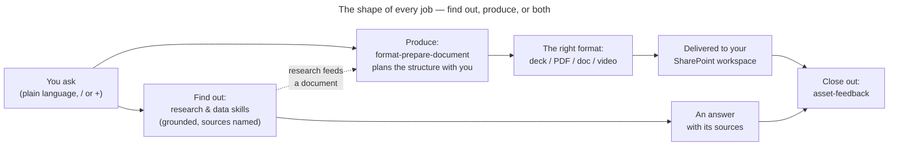

# Stromy Workflows guide

<!-- enablement-core:begin -->

## What Stromy is, in simple terms

Stromy builds you an AI teammate that lives inside Claude — the assistant you're
using right now. What makes yours different from a generic assistant is that
**your setup is locked in**: your company's brand, voice, and working style, and
the data sources and tools your work depends on. You never re-supply that
context — it travels with you into every conversation.

- **A plugin** is the package that carries your setup — who you are, how your
  work should look and sound, and which specialist tools you have.
- **A skill** is one of those specialist tools — one job, done properly:
  planning a document, running a piece of research, editing your brand.
- **An MCP** (you don't need to remember the term) is an engine behind the
  scenes — the thing that actually renders the PDF or queries the data source.
  You never talk to it directly — you talk to Claude, and Claude reaches for
  the right tool.

## What your tools do — two families

Every Stromy skill belongs to one of two families:

- **Produce** — turn ideas into finished work: documents, presentations, PDFs,
  spreadsheets, charts, videos, brand and website edits. Everything produced
  carries your brand automatically.
- **Find out** — answer questions from real sources: government and
  parliamentary data, official publications, statistics, web content, or your
  own organisation's knowledge. Answers are **grounded** — they name their
  sources, and when something can't be verified, Claude says so instead of
  guessing.

Many jobs chain the two — research first, then a branded report built from it.
Many stop at one: a quick deck needs no research, and a sharp answer with
sources often needs no document at all. Both are complete jobs.

## Two ways to run a skill

Most of the time you won't run a skill deliberately at all: just describe what
you want — *"Put together a proposal PDF for Thursday"*, *"What has parliament
said about this lately?"* — and Claude picks the right one for you. That's the
everyday path, and it's the one to reach for first.

When you already know which tool you want, there are **two ways** to invoke it
directly:

1. **The `/` menu** — type `/` in the message box and a list of available skills
   appears; pick one.
2. **The `+` menu → Plugins** — click the `+` next to the message box, open
   **Plugins**, and choose the skill from your plugin's list. Same result as `/`,
   just a different door — handy when you're browsing what a plugin offers.

You'll see skills referred to by name (like `format-pdf-hd`) in Claude's replies
— that's just it telling you which tool it used.

## Your context travels with the plugin

Your setup lives **inside the plugin** — for produced work that means your
colours, fonts, logo, and voice; for research it means your data access and
preferences. If you have several Stromy plugins installed — one per brand or
entity — then **run the skill from the plugin of the one you want**, and its
setup applies automatically. In the `/` and `+` menus, skills are grouped by
their plugin, so picking the skill under `your-brand` is what selects
`your-brand`'s context. You never re-describe it per request.

If you want to *change* the setup itself — a new logo, a colour tweak, updated
boilerplate — that's a separate skill, `asset-editor` (covered in the asset
guide), not something you do by restyling each document.

## The shape of every job

Whatever you ask lands on one of the two family paths — or chains them — and
every job closes the same way. Keeping this picture in mind tells you what
happens next at any point:

## A few things that always hold true

- **Your context resolves automatically** from your plugin — brand for outputs,
  data access for research. You never upload or describe it. If something
  genuinely can't be found, Claude says so plainly rather than guessing or
  using a generic stand-in.
- **Research names its sources.** Grounded answers cite where they came from,
  and an unverifiable claim is flagged as such — never papered over. If a data
  source is down, you'll be told, so silence from a source is never read as
  "there's nothing there".
- **Finished work lands in your SharePoint workspace**, organised by client and
  project where that's set up — Claude gives you the link. No
  download-and-reupload.
- **Every flow ends with feedback.** Once something's delivered, the
  `asset-feedback` skill runs. It has **two modes, in order**: first, an automatic
  **retrospective** where Claude records how the run actually went (including
  anything it had to improvise or couldn't find) — this happens on its own; then,
  optionally, it invites **your** feedback on the result itself. Take that
  offer when you have a view — it's how the tools and your setup get sharper.
  It takes seconds.

<!-- enablement-core:end -->

## What this service does

Stromy Workflows runs longer analyses on managed infrastructure after the user reviews
their configuration. The conversation remains the control surface: the user answers a
short interview, confirms the run, reviews any human-in-the-loop pause, and receives the
finished artifact links without keeping a laptop or chat session alive.

The **Stromy Workflows workspace connector** provides the execution tools. It is a
separate OAuth connection because the server verifies which client each user may access;
the plugin carries the `wf-*` guide and client context but never embeds that connection.

## The lifecycle

1. Choose the workflow-specific `wf-*` skill.
2. Review its tier-1 questions and safe tier-2 defaults. Provider controls remain locked.
3. Validate the full configuration, review its in-chat summary, and explicitly confirm.
4. The service starts one isolated run and returns a `run_id`.
5. If the run pauses for review, inspect the payload and resume the same run.
6. On completion, receive its durable destination and any temporary download link.

A slow first response can be an ordinary scale-from-zero start. A failed status is still
reported explicitly; the guide never treats silence or a queued run as completion.

## Choosing a workflow

<!-- guide-inventory:begin -->
<!-- GENERATED by scripts/sync-guide-inventory.py — DO NOT EDIT this region. -->

| Skill | What it does |
|---|---|
| `wf-stakeholder-analysis` | Run a hosted stakeholder-acceptance analysis from a client plugin: gather the decision and evidence settings, validate the safe workflow configuration, start the asynchronous run, handle questionnaire review, and return its report links. |

<!-- guide-inventory:end -->

If the requested analysis is not in this inventory, say that the hosted catalog does not
currently expose it. Do not substitute a similarly named workflow without the user's
agreement.

## Connection and scope

If `stromy-workflows` tools are absent, ask the user to connect **Stromy Workflows** in
their workspace settings. Never attempt local execution as a hidden fallback. Each client
role can see only its own runs; operators may support several clients. A user with several
authorized client roles must select the intended plugin/client before starting.
