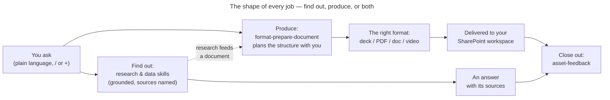

# Stromy Workflows guide

<!-- enablement-core:begin -->

## What Stromy is, in simple terms

Stromy builds you an AI teammate that lives inside Claude — the assistant you're
using right now. What makes yours different from a generic assistant is that
**your setup is locked in**: your company's brand, voice, and working style, and
the data sources and tools your work depends on. You never re-supply that
context — it travels with you into every conversation.

- **A plugin** is the package that carries your setup — who you are, how your
  work should look and sound, and which specialist tools you have.
- **A skill** is one of those specialist tools — one job, done properly:
  planning a document, running a piece of research, editing your brand.
- **An MCP** (you don't need to remember the term) is an engine behind the
  scenes — the thing that actually renders the PDF or queries the data source.
  You never talk to it directly — you talk to Claude, and Claude reaches for
  the right tool.

You can see all three in *your* setup just by asking. In any chat, say
**"describe my workspace"** — or *"what skills and tools do I have here?"* — and
Claude will tell you what it can actually see: your plugin, the skills it gives
you, and which engines are switched on for this conversation. It's the quickest
way to get your bearings in a new chat, the first thing to try when something
seems missing, and you can keep asking from there (*"what can the research skills
do?"*). Nothing to learn or install — just ask.

## What your tools do — two families

Every Stromy skill belongs to one of two families:

- **Produce** — turn ideas into finished work: documents, presentations, PDFs,
  spreadsheets, charts, videos, brand and website edits. Everything produced
  carries your brand automatically.
- **Find out** — answer questions from real sources: government and
  parliamentary data, official publications, statistics, web content, or your
  own organisation's knowledge. Answers are **grounded** — they name their
  sources, and when something can't be verified, Claude says so instead of
  guessing.

Many jobs chain the two — research first, then a branded report built from it.
Many stop at one: a quick deck needs no research, and a sharp answer with
sources often needs no document at all. Both are complete jobs.

## Two ways to run a skill

Most of the time you won't run a skill deliberately at all: just describe what
you want — *"Put together a proposal PDF for Thursday"*, *"What has parliament
said about this lately?"* — and Claude picks the right one for you. That's the
everyday path, and it's the one to reach for first.

When you already know which tool you want, there are **two ways** to invoke it
directly:

1. **The `/` menu** — type `/` in the message box and a list of available skills
   appears; pick one.
2. **The `+` menu → Plugins** — click the `+` next to the message box, open
   **Plugins**, and choose the skill from your plugin's list. Same result as `/`,
   just a different door — handy when you're browsing what a plugin offers.

You'll see skills referred to by name (like `format-pdf-hd`) in Claude's replies
— that's just it telling you which tool it used.

## Your context travels with the plugin

Your setup lives **inside the plugin** — for produced work that means your
colours, fonts, logo, and voice; for research it means your data access and
preferences. If you have several Stromy plugins installed — one per brand or
entity — then **run the skill from the plugin of the one you want**, and its
setup applies automatically. In the `/` and `+` menus, skills are grouped by
their plugin, so picking the skill under `your-brand` is what selects
`your-brand`'s context. You never re-describe it per request.

If you want to *change* the setup itself — a new logo, a colour tweak, updated
boilerplate — that's a separate skill, `asset-editor` (covered in the asset
guide), not something you do by restyling each document.

## The shape of every job

Whatever you ask lands on one of the two family paths — or chains them — and
every job closes the same way. Keeping this picture in mind tells you what
happens next at any point:

```mermaid
---
title: The shape of every job — find out, produce, or both
---
flowchart LR
    A["You ask<br/>(plain language, / or +)"] --> FO["Find out:<br/>research & data skills<br/>(grounded, sources named)"]
    A --> PR["Produce:<br/>format-prepare-document<br/>plans the structure with you"]
    FO -.->|"research feeds<br/>a document"| PR
    PR --> R["The right format:<br/>deck / PDF / doc / video"]
    R --> SP["Delivered to your<br/>SharePoint workspace"]
    FO --> ANS["An answer<br/>with its sources"]
    SP --> FB["Close out:<br/>asset-feedback"]
    ANS --> FB
```

## A few things that always hold true

- **Your context resolves automatically** from your plugin — brand for outputs,
  data access for research. You never upload or describe it. If something
  genuinely can't be found, Claude says so plainly rather than guessing or
  using a generic stand-in.
- **Research names its sources.** Grounded answers cite where they came from,
  and an unverifiable claim is flagged as such — never papered over. If a data
  source is down, you'll be told, so silence from a source is never read as
  "there's nothing there".
- **Finished work lands in your SharePoint workspace**, organised by client and
  project where that's set up — Claude gives you the link. No
  download-and-reupload.
- **Every flow ends with feedback.** Once something's delivered, the
  `asset-feedback` skill runs. It has **two modes, in order**: first, an automatic
  **retrospective** where Claude records how the run actually went (including
  anything it had to improvise or couldn't find) — this happens on its own; then,
  optionally, it invites **your** feedback on the result itself. Take that
  offer when you have a view — it's how the tools and your setup get sharper.
  It takes seconds.

<!-- enablement-core:end -->

## What this service does

Stromy Workflows runs longer analyses on managed infrastructure after the user reviews
their configuration. The conversation remains the control surface: the user answers a
short interview, confirms the run, reviews any human-in-the-loop pause, and receives the
finished artifact links without keeping a laptop or chat session alive.

The **Stromy Workflows workspace connector** provides the execution tools. It is a
separate OAuth connection because the server verifies which client each user may access;
the plugin carries the `wf-*` guide and client context but never embeds that connection.

## The lifecycle

1. Choose the workflow-specific `wf-*` skill.
2. Review its tier-1 questions and safe tier-2 defaults. Provider controls remain locked.
3. Validate the full configuration, review its in-chat summary, and explicitly confirm.
4. The service starts one isolated run and returns a `run_id`.
5. While it runs, the status reports which stage it is on and when the runner last
   checked in, so a long job can be described honestly instead of as "still going".
6. If the run pauses for review, inspect the payload and resume the same run.
7. On completion, receive its durable destination and any temporary download link.
   Download links are minted per call and expire in minutes; the artifact behind one
   does not. Re-call `get_results` for a fresh link instead of re-sending an old one.
8. If it fails, a **retry** starts a new run that reuses whatever the failed attempt
   already finished — cheaper and faster than starting over, and the failed run stays
   as the record. Retry applies only to a failed run: a paused one resumes, and a
   completed one already has its results.

A slow first response can be an ordinary scale-from-zero start. A failed status is still
reported explicitly; the guide never treats silence or a queued run as completion.

## Provider keys: whose account pays

Most runs spend **Stromy's** provider keys and the user needs to do nothing — that is the
default and it is what every current client is on. Some arrangements instead run on the
**client's own** keys, so the model and data-provider costs land on their account.

Call `get_credential_status` when the user asks who pays, when a run fails for missing
credentials, or before walking someone through connecting a key. Read the reply in this
order:

1. **`credential_policy`.** On `operator`, Stromy pays and there is nothing to connect —
   say so and stop. Only on `client` does an unconnected key mean an outstanding action.
2. **`status` per credential.** `registered` and `not_registered` mean what they say.
   **`unavailable` does NOT mean "no key"** — it means the server cannot read registration
   state at all. Never tell someone they have no key connected on the strength of it;
   report that the server can't check right now.

### Connecting, rotating and disconnecting

`create_credential_registration_link` returns a URL the user opens in a browser.

**Never ask for an API key in the chat, and never pass one to a tool.** The link exists so
the key travels from the user's browser to the vault without passing through the
conversation, the transcript, or any log. If a user pastes a key to you anyway, tell them
plainly to treat it as compromised and rotate it at the provider — a key in a chat log is
a key that has leaked, and pretending otherwise costs them real money.

- **Connect or rotate** — the same call. Registering again replaces the stored key, so a
  rotation needs no special action and no disconnect first.
- **Disconnect** — the same call with `action="disconnect"`, which mints a link that
  disables the stored key. Tell the user this stops *Stromy* using it; if they think it
  leaked, they must also revoke it at the provider, which is the only thing that stops it
  being used elsewhere.

Links are **single-use and short-lived** (15 minutes). Reloading the page does not consume
one — only a successful save does — so a user who mistypes can correct it on the same link.
An expired or spent link is normal, not an error: mint a fresh one without ceremony.

Hand the link to whoever actually holds the key. That is often not the person in the
conversation, and the link is designed to be forwarded.

## Choosing a workflow

<!-- guide-inventory:begin -->
<!-- GENERATED by scripts/sync-guide-inventory.py — DO NOT EDIT this region. -->

| Skill | What it does |
|---|---|
| `wf-stakeholder-analysis` | Map who supports or resists a decision, and what would move them. |

<!-- guide-inventory:end -->

If the requested analysis is not in this inventory, say that the hosted catalog does not
currently expose it. Do not substitute a similarly named workflow without the user's
agreement.

## Connection and scope

If `stromy-workflows` tools are absent, ask the user to connect **Stromy Workflows** in
their workspace settings. Never attempt local execution as a hidden fallback. Each client
role can see only its own runs; operators may support several clients. A user with several
authorized client roles must select the intended plugin/client before starting.
